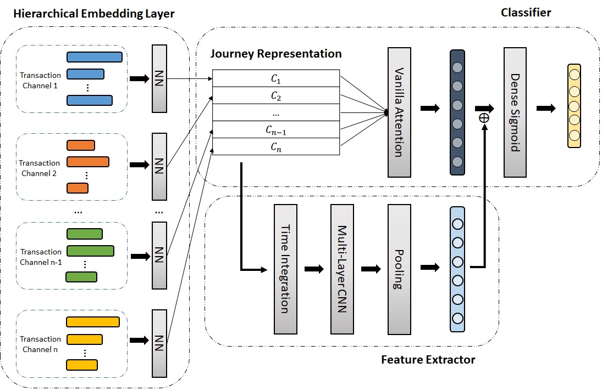

# Financial-Product-Recommendation
Consider customer profiles and journeys in past months as input information and predict what financial products will customers purchase in the current month. It is a muli-label classification problem.

### Data:
- Customer profile
  - Contains demographic and geographic information, as well as account information, of an individual customer.
- Customer journey
  - Records a set of time-ordered transactions representing the sequence of interactions of a customer with a financial institution, for example, cash advancing, withdrawing, credit card swiping, and money transferring. Each transaction contains multiple attributes (but may in different length), such as action type, price, and time.
- Purchase history
  - There are five types of financial products, the history records the product purchases of each customer for each month. 

All the data are monthly-updated and last for a year. The data of the latest month is split as the testing set.

### Model structure:
- Customer profile
  - Three classifiers are compared: xgboost, dnn, and random forest. The input profile features are preprocessed by min-max scaler (for continuous variables) and one-hot encoding (for categorical variables). Heavy feature engineering is done in this part such as deriving useful features that can reflect customer's financial status from the original account features.
- Customer journey
  - The customer data are hetergenous (contains transactions from muliple financial services) and sequential. To deal with the heterogenity, I use a hierarchcial embedding layer to encode the transactions, which maps each transaction attribute to its corresponding latent space. Then, concatenate these attribute representations to form a transaction's representation. Concatenate the transaction representation along the time axis to form the customer journey representation matrix.
  - Modeling the temporal information in the customer journey is essential. The time dilated model integrates temporal information into the journey representation by putting temporal embedding and transaction embedding in staggered order, while the time mask model multiplies temporal embedding with the transaction embedding.
  - Finally, a temporal convolution network ([TCN](https://arxiv.org/pdf/1803.01271.pdf)) is implemented as the classifier.
    
    
    
    
